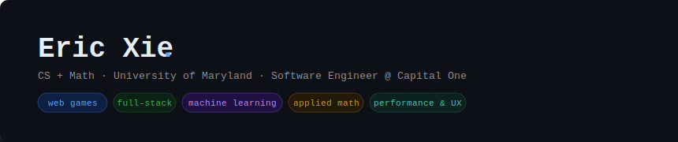

  

---

I build full-stack applications and web games, and I'm obsessive about
performance and user experience. CS + Math background with a focus on
applied ML and clean, fast software.

---

## Experience

| | |
|---|---|
| **2026** | Capital One — Software Engineer |
| **2025** | Capital One — Software Engineering Intern · Security tooling & Chrome extensions |
| **2024** | Boston Scientific — Software Engineering Intern · RAG tooling & LLM deployment |
| **2022** | Precidiag — ML Intern · 100× training efficiency improvement |

---

## Projects

**[Kalshi AI Forecaster](link)**
Prediction market trading agent using Gemini Pro + LangChain. Custom VWAP features, real-time UI, outperformed human baselines.
`Python` `LangChain` `Flask` `React`

**[Tank Arena](link)**
Real-time multiplayer game with WebSocket server, fog-of-war rendering, and room/state management.
`p5.js` `Node.js` `WebSocket`

**[BitTorrent Client](link)**
Full P2P client from scratch — tracker comms, SHA-1 piece validation, multi-threading with `select()`.
`Python` `networking` `concurrency`

**[Graph Analysis](link)**
3D geometric reconstruction via SDP and spectral clustering. 99.7% accuracy using SVD alignment.
`MATLAB` `SDP` `spectral methods`

---
<svg width="860" height="180" viewBox="0 0 860 180" xmlns="http://www.w3.org/2000/svg">
  <defs>
    <pattern id="grid" width="32" height="32" patternUnits="userSpaceOnUse">
      <path d="M 32 0 L 0 0 0 32" fill="none" stroke="rgba(255,255,255,0.03)" stroke-width="1"/>
    </pattern>
    <linearGradient id="fadeRight" x1="0" y1="0" x2="1" y2="0">
      <stop offset="0%" stop-color="#0d1117" stop-opacity="0"/>
      <stop offset="100%" stop-color="#0d1117" stop-opacity="1"/>
    </linearGradient>
    <linearGradient id="fadeBottom" x1="0" y1="0" x2="0" y2="1">
      <stop offset="0%" stop-color="#0d1117" stop-opacity="0"/>
      <stop offset="100%" stop-color="#0d1117" stop-opacity="1"/>
    </linearGradient>
  </defs>

  <!-- Background -->
  <rect width="860" height="180" rx="10" fill="#0d1117"/>

  <!-- Grid -->
  <rect width="860" height="180" rx="10" fill="url(#grid)"/>

  <!-- Fade right -->
  <rect x="640" width="220" height="180" fill="url(#fadeRight)"/>

  <!-- Fade bottom -->
  <rect y="120" width="860" height="60" fill="url(#fadeBottom)"/>

  <!-- Name -->
  <text x="48" y="72" font-family="Courier New, monospace" font-size="36" font-weight="700" fill="#e6edf3" letter-spacing="-0.5">Eric Xie</text>
  <text x="202" y="72" font-family="Courier New, monospace" font-size="36" font-weight="700" fill="#58a6ff">.</text>

  <!-- Role -->
  <text x="48" y="100" font-family="Courier New, monospace" font-size="13" fill="#8b949e">CS + Math · University of Maryland · Software Engineer @ Capital One</text>

  <!-- Pills -->
  <!-- web games -->
  <rect x="48" y="118" width="88" height="24" rx="12" fill="#0d2044" stroke="#1f3f6e" stroke-width="1"/>
  <text x="92" y="134" font-family="Courier New, monospace" font-size="11" fill="#58a6ff" text-anchor="middle">web games</text>

  <!-- full-stack -->
  <rect x="144" y="118" width="79" height="24" rx="12" fill="#0b2215" stroke="#1a3d24" stroke-width="1"/>
  <text x="183.5" y="134" font-family="Courier New, monospace" font-size="11" fill="#3fb950" text-anchor="middle">full-stack</text>

  <!-- machine learning -->
  <rect x="231" y="118" width="127" height="24" rx="12" fill="#1e1040" stroke="#3d2a6e" stroke-width="1"/>
  <text x="294.5" y="134" font-family="Courier New, monospace" font-size="11" fill="#bc8cff" text-anchor="middle">machine learning</text>

  <!-- applied math -->
  <rect x="366" y="118" width="95" height="24" rx="12" fill="#221a07" stroke="#4a3510" stroke-width="1"/>
  <text x="413.5" y="134" font-family="Courier New, monospace" font-size="11" fill="#d29922" text-anchor="middle">applied math</text>

  <!-- performance & UX -->
  <rect x="469" y="118" width="122" height="24" rx="12" fill="#0b221e" stroke="#1a3d35" stroke-width="1"/>
  <text x="530" y="134" font-family="Courier New, monospace" font-size="11" fill="#39d0b0" text-anchor="middle">performance &amp; UX</text>
</svg>

## Stack

